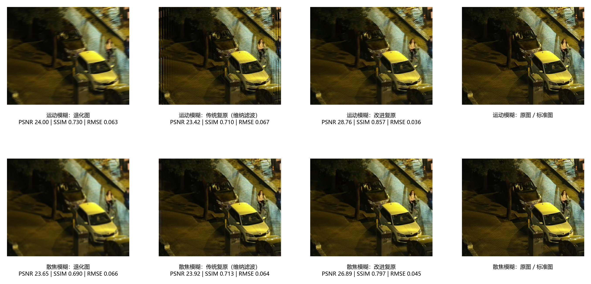
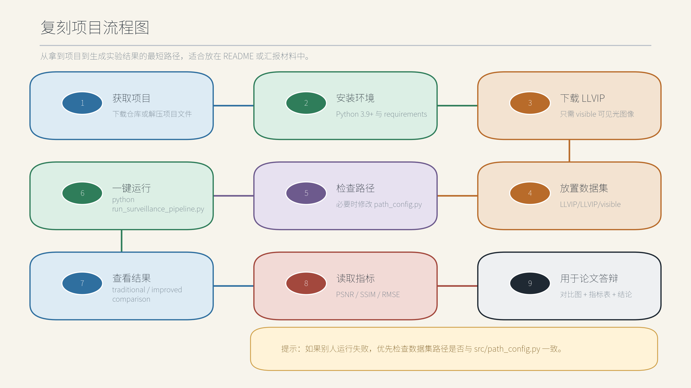
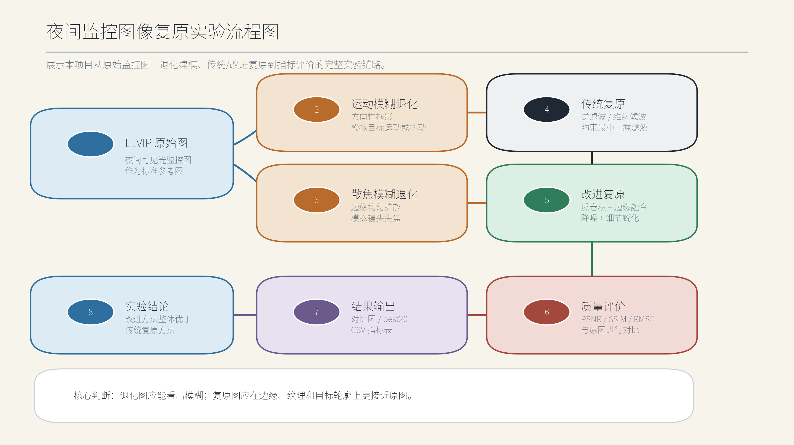
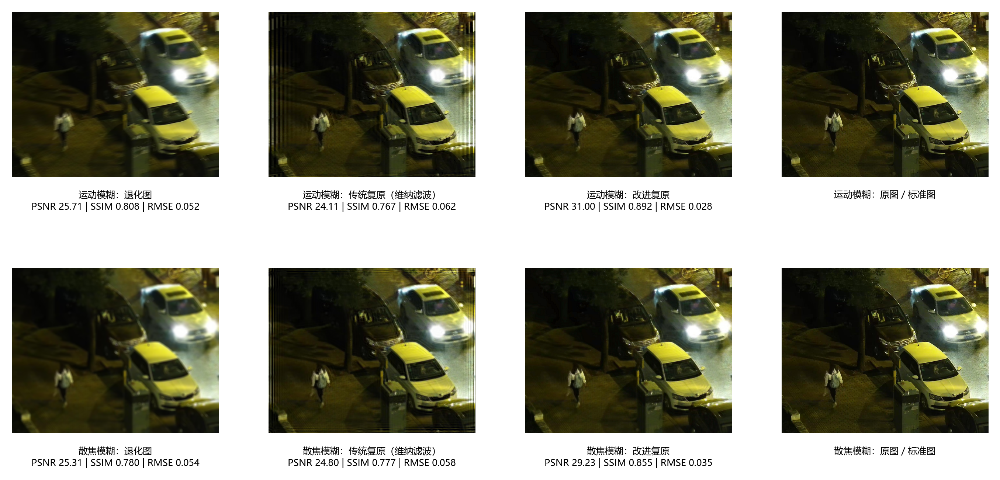
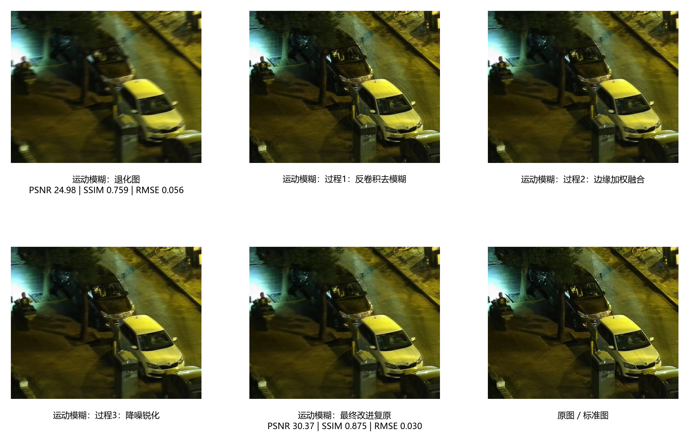

# 夜间监控图像模糊复原

本项目面向夜间监控场景中的图像复原问题，使用 LLVIP 可见光夜间监控图像作为原始参考图，分别构造运动模糊和散焦模糊退化图像，再对传统复原方法与改进复原方法进行对比实验。

项目重点不是简单增强亮度，而是围绕监控图像中常见的模糊退化进行复原：运动模糊模拟车辆、行人或摄像头抖动造成的方向性拖影；散焦模糊模拟摄像机失焦或景深不足造成的整体边缘扩散。



## 先下载数据集

运行本项目之前，需要先下载 LLVIP 数据集。本仓库不包含完整 LLVIP 原始数据集，只保留少量示例结果图，避免仓库体积过大，也避免重新分发第三方数据集。

推荐优先查看官方链接：

- LLVIP 官方项目主页：<https://bupt-ai-cz.github.io/LLVIP/>
- LLVIP 官方 GitHub：<https://github.com/bupt-ai-cz/LLVIP>
- LLVIP 数据集下载说明：<https://github.com/bupt-ai-cz/LLVIP/blob/main/download_dataset.md>
- LLVIP 论文 arXiv：<https://arxiv.org/abs/2108.10831>
- LLVIP 官方许可说明：<https://github.com/bupt-ai-cz/LLVIP/blob/main/Term%20of%20Use%20and%20License.md>
- LLVIP Kaggle 相关页面：<https://www.kaggle.com/c/find-person-in-the-dark>
- Papers with Code 页面：<https://paperswithcode.com/sota/pedestrian-detection-on-llvip>

下载后请把可见光图像放到下面的位置：

```text
项目根目录/
└── LLVIP/
    └── LLVIP/
        └── visible/
            ├── 190001.jpg
            ├── 190002.jpg
            └── ...
```

默认路径已经写在 `src/path_config.py` 中：

```python
LLVIP_VISIBLE_DIR = PROJECT_ROOT / "LLVIP" / "LLVIP" / "visible"
```

如果你的数据集放在其他位置，只需要修改 `src/path_config.py` 中这一行即可。其余代码不需要改。

## 关于 LLVIP 数据集

LLVIP 的全称是 **LLVIP: A Visible-infrared Paired Dataset for Low-light Vision**，是一个面向低照度视觉任务的可见光-红外成对数据集。官方 README 中说明，当前发布版本包含 30976 张图像，并提供可见光图像、红外图像以及行人检测相关标注，常用于低照度目标检测、可见光-红外图像融合和夜间场景感知等研究。

本项目只使用 LLVIP 中的 `visible` 可见光夜间监控图像。选择这个数据集的原因是：它不是普通风景图片，而是更接近真实监控视角，画面中包含道路、车辆、行人、灯光、阴影和夜间低照度环境。这些特点与“夜间监控图像复原”主题更匹配，也方便在论文或答辩中解释复原后的实际意义。

在本项目中，LLVIP 可见光图像作为“原图/标准图”。程序会在原图基础上构造运动模糊和散焦模糊退化图，再分别使用传统方法和改进方法进行复原。因此实验逻辑是：

```text
LLVIP 原始夜间监控图
        ↓
构造运动模糊 / 散焦模糊退化图
        ↓
传统方法复原 / 改进方法复原
        ↓
与原始监控图计算 PSNR、SSIM、RMSE
```

## 数据集许可、引用与致谢

本项目不是 LLVIP 官方仓库，也不声称 LLVIP 数据集由本项目创建。LLVIP 官方许可说明中明确表示，数据集可用于学术研究、教学、科学出版和个人实验等非商业用途；使用时需要引用 LLVIP 数据集或其论文；不得将数据集或基于该数据集形成的派生数据用于商业销售、授权或其他商业获利目的。

本仓库遵循以下处理原则：

- 不上传完整 LLVIP 原始数据集。
- 示例结果仅用于展示夜间监控图像模糊复原流程。
- 若权利方或数据集维护者要求删除相关示例图，本仓库将及时移除。
- 使用者若下载并使用 LLVIP，应自行确认其用途符合 LLVIP 官方许可。
- 若后续用于论文、报告、答辩或公开展示，请明确说明图像数据来源于 LLVIP，并引用其原始论文。

推荐引用格式：

```bibtex
@inproceedings{jia2021llvip,
  title={LLVIP: A visible-infrared paired dataset for low-light vision},
  author={Jia, Xinyu and Zhu, Chuang and Li, Minzhen and Tang, Wenqi and Zhou, Wenli},
  booktitle={Proceedings of the IEEE/CVF International Conference on Computer Vision},
  pages={3496--3504},
  year={2021}
}
```

也可以引用 arXiv 版本：

```bibtex
@misc{llvip_arxiv_2021,
  title={LLVIP: A Visible-infrared Paired Dataset for Low-light Vision},
  author={Jia, Xinyu and Zhu, Chuang and Li, Minzhen and Tang, Wenqi and Liu, Shengjie and Zhou, Wenli},
  year={2021},
  eprint={2108.10831},
  archivePrefix={arXiv},
  primaryClass={cs.CV},
  doi={10.48550/arXiv.2108.10831},
  url={https://arxiv.org/abs/2108.10831}
}
```

## 项目特点

- 使用原始 LLVIP 夜间监控图像作为标准图，不再把增强后的图像当作原图。
- 支持两类退化场景：运动模糊和散焦模糊。
- 传统方法包括逆滤波、维纳滤波和约束最小二乘滤波。
- 改进方法采用反卷积去模糊、边缘加权融合、双边降噪和细节锐化的分阶段流程。
- 自动生成结果图片、对比图、best 结果图和指标表。
- 指标包括 PSNR、SSIM 和 RMSE，便于论文或答辩中进行客观分析。

## 目录结构

```text
.
├── run_surveillance_pipeline.py      # 推荐运行入口
├── run_surveillance_demo.py          # 只运行复原实验
├── prepare_surveillance_samples.py   # 只准备样本图片
├── requirements.txt                  # Python 依赖
├── src/
│   ├── path_config.py                # 路径配置，换电脑时主要看这里
│   ├── degradation.py                # 模糊退化模型
│   ├── metrics.py                    # PSNR / SSIM / RMSE
│   ├── run_surveillance_pipeline.py  # 一键流程
│   ├── run_surveillance_demo.py      # 实验主流程
│   └── methods/
│       ├── deconv_filters.py         # 传统反卷积滤波
│       ├── improved_method.py        # 改进复原方法
│       └── spatial_filters.py        # 空间域滤波辅助方法
└── examples/
    └── results/                      # 轻量示例结果，不包含完整数据集
```

## 环境安装

建议使用 Python 3.9 或更高版本。

```powershell
python -m venv .venv
.\.venv\Scripts\activate
pip install -r requirements.txt
```

## 复刻项目流程图

如果你想在另一台电脑上复刻本项目，按下面流程做即可：



实验内部处理流程如下：



## 一键运行

推荐直接运行：

```powershell
python run_surveillance_pipeline.py
```

如果只是快速测试，可以限制处理数量：

```powershell
python run_surveillance_pipeline.py --limit 5
```

运行结束后，终端会打印主要输出路径：

```text
sample_path: surveillance_samples
result_path: surveillance_results
traditional_path: surveillance_results/traditional
improved_path: surveillance_results/improved
```

## 示例结果与指标对比

下面是仓库中保留的一张示例对比图，用于快速查看退化图、传统方法、改进方法和原图之间的差别：



改进最明显的示例结果可以查看 `examples/results/improved_best20/`。其中第一张示例如下：



5 张示例样本的整体平均指标如下：

| 方法 | PSNR | SSIM | RMSE |
|---|---:|---:|---:|
| 改进复原 | 29.0153 | 0.8443 | 0.0357 |
| 维纳滤波 | 24.2545 | 0.7345 | 0.0613 |
| 逆滤波 | 23.1702 | 0.7161 | 0.0695 |
| 约束最小二乘 | 14.9024 | 0.2531 | 0.1860 |

按退化类型统计的平均指标如下：

| 退化类型 | 方法 | PSNR | SSIM | RMSE |
|---|---|---:|---:|---:|
| 运动模糊 | 改进复原 | 29.8771 | 0.8701 | 0.0322 |
| 运动模糊 | 维纳滤波 | 23.9892 | 0.7332 | 0.0632 |
| 运动模糊 | 逆滤波 | 23.0011 | 0.7106 | 0.0708 |
| 运动模糊 | 约束最小二乘 | 12.8292 | 0.1603 | 0.2301 |
| 散焦模糊 | 改进复原 | 28.1535 | 0.8185 | 0.0393 |
| 散焦模糊 | 维纳滤波 | 24.5198 | 0.7358 | 0.0595 |
| 散焦模糊 | 逆滤波 | 23.3394 | 0.7215 | 0.0681 |
| 散焦模糊 | 约束最小二乘 | 16.9755 | 0.3459 | 0.1419 |

从表格可以看出，改进复原方法在运动模糊和散焦模糊两类退化下都取得了更高的 PSNR、SSIM 和更低的 RMSE，说明它不仅在单张图上视觉效果更好，在平均指标上也优于传统滤波方法。

## 结果文件说明

运行后会生成 `surveillance_results` 文件夹，主要内容如下：

```text
surveillance_results/
├── traditional/                  # 传统方法结果
├── improved/                     # 改进方法结果
├── comparison/                   # 同一图片的退化图、复原图、原图对比
├── improved_best20/              # 改进最明显的结果图
├── surveillance_summary.csv      # 各方法平均指标
├── surveillance_case_summary.csv # 不同退化类型下的平均指标
└── surveillance_details.csv      # 每张图片的详细指标
```

## 方法说明

传统方法主要用于建立基线：

- 逆滤波直接根据退化函数进行频域恢复，对噪声和核误差非常敏感。
- 维纳滤波在复原时考虑噪声抑制，稳定性通常优于逆滤波。
- 约束最小二乘滤波加入平滑约束，但参数不合适时容易造成过度平滑。

改进方法针对夜间监控图像的特点进行处理：

- 先使用反卷积削弱运动模糊或散焦模糊。
- 再通过边缘加权融合保留车辆边缘、道路纹理和行人轮廓。
- 然后使用双边滤波抑制噪声，同时尽量保留边界。
- 最后进行细节锐化，使复原图在视觉上更清晰。

## 适合汇报的结论

从示例结果可以看出，改进复原方法在 PSNR、SSIM 和 RMSE 三项指标上均优于传统方法。传统方法虽然能够进行一定程度的去模糊，但容易出现噪声放大、边缘振铃和细节丢失；改进方法通过分阶段处理，在抑制模糊扩散的同时保留了夜间监控图像中的关键结构信息，因此更适合车辆、道路标线、行人边界和交通信号区域的复原分析。

## 注意事项

- 本项目不上传完整 LLVIP 数据集，避免仓库体积过大。
- `examples/results` 只用于展示运行效果，不代表完整实验规模。
- 如果换电脑运行失败，优先检查 `src/path_config.py` 中的数据集路径。
- 如果图片很多，完整运行时间会明显增加，建议先用 `--limit 5` 测试。
